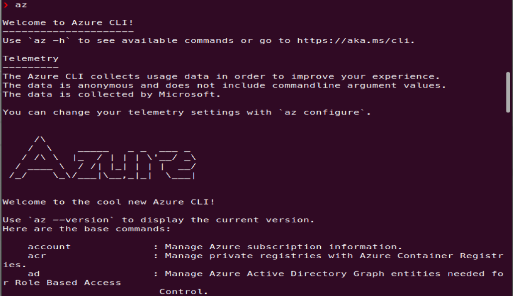
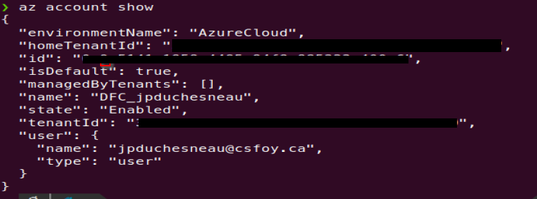
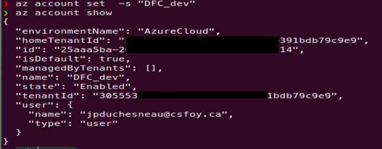
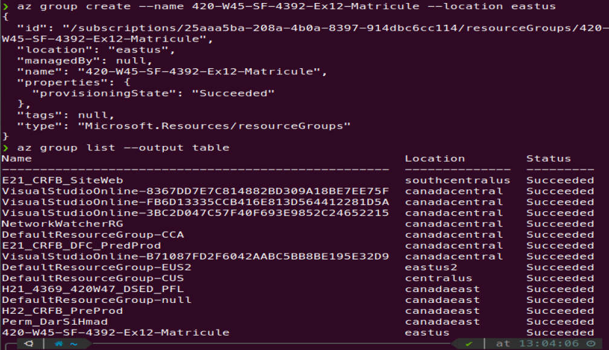
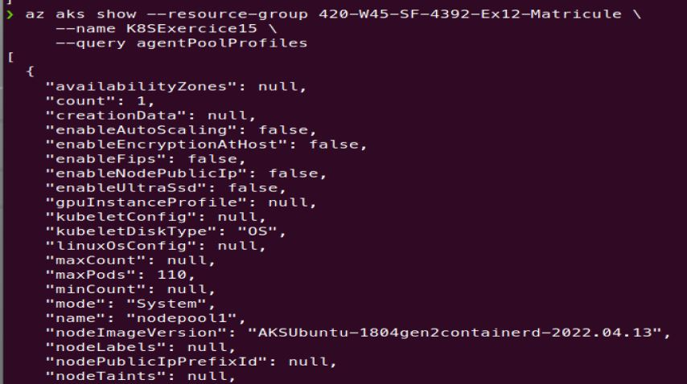
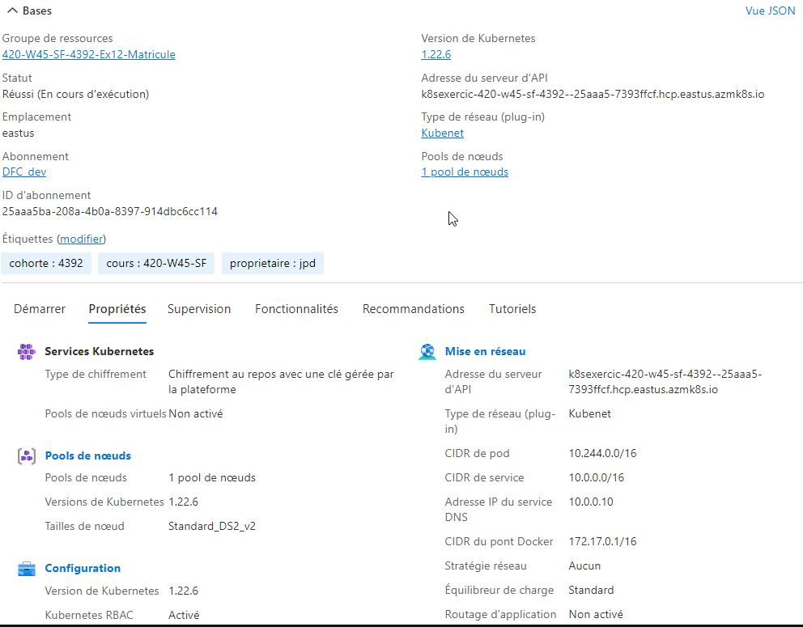
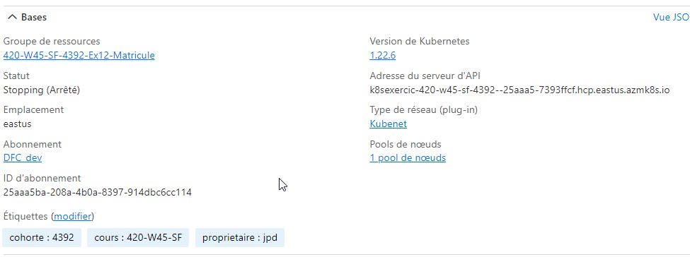

# Exercice 15 - Azure Kubernetes

Dans cet exercice, nous allons mettre en place un cluster Kubernetes avec le fournisseur Azure.

Azure Kubernetes Service (AKS) simplifie le déploiement d'un cluster Kubernetes géré dans Azure en déchargeant les frais généraux opérationnels sur Azure. En tant que service Kubernetes hébergé, Azure se charge des tâches critiques, comme la surveillance de l'état de santé et la maintenance. Les maîtres Kubernetes étant gérés par Azure, vous ne gérez et ne maintenez que les nœuds agents.


## Préalable

### Quel compte utiliser 

Si vous avez toujours de crédits sur votre compte personnel Azure. Vous pouvez utiliser votre proppre compte pour faire les exercice sur AKS.

Si non, faite la demande à votre enseignant, il vas vous créer un groupe de ressource sur le compte *DFC-Dev* du département d'informatique de la DFC du Cégep.

### Installation d'Azure CLI sur Linux
L'Azure CLI est un outil de ligne de commande multiplateforme qui peut être installé localement sur les ordinateurs Linux. Vous pouvez utiliser l'Azure CLI sur Linux pour vous connecter à Azure et exécuter des commandes administratives sur les ressources Azure. 

Microsoft nous prpose deux options pour installer l'Azure CLI sur votre système. Nous allons utilisé la premier qui téléchargera un script d'installation et exécutera les commandes d'installation pour vous. 

```bash
curl -sL https://aka.ms/InstallAzureCLIDeb | sudo bash
```


### Démarrez avec Azure CLI



#### Définissez votre abonnement

```bash
az login
```
Cette commande provoque l'ouverture d'une demande de connexions dans votre navigateur.
Après avoir entré les information de connexion, vous devriez avoir ce message :


Vous pouvez visiter ce lien pour avoir la liste des principale commandes utilisées dans l’interface CLI ainsi que des liens vers leur documentation de référence.

https://docs.microsoft.com/fr-fr/cli/azure/get-started-with-azure-cli

```bash
# Avoir l'aide
az --help

```


Dans Azure, les projet ou les applications doivent être placé dans un groupe de ressource qui lui appartient à un abonnement.

Pour vérifier votre abonnement : 
```bash
az account show # Voir sur quel abonnement je suis

```
Exemple de sortie pour az account show :



```bash
az account show # Voir sur quel abonnement je suis
az account list # Lister mes abonnement
az account set  -s "DFC_dev" # Sélectionner un abonnement
```


Pour vérifier les groupes de ressource :

```bash
az ad group show

```


## Création d'un groupe de ressouces pour K8S

**Attention**, seulement pour les personnes qui utilisent leur propre compte Azure. Les autres, vous utiliserais celui fournis par le professeur car vous  n'avez pas le pouvoir de créer vos groupe de ressources.

```bash
az group create --name 420-W45-SF-4392-Ex12-Matricule --location eastus
```
Bien sur, changer le mot matricule par le votre.



Création d'un unité de stockage 
az storage account create --resource-group MyResourceGroup --name storage134 --location eastus --sku Standard_LRS

Il existe également un plug-in Visual Studio Code qui propose une expérience interactive, comprenant l’autocomplétion et le survol de la documentation.

## Vérifier 

Vérifiez que Microsoft.OperationsManagement et Microsoft.OperationalInsights sont enregistrés sur votre abonnement. Pour vérifier l'état de l'enregistrement :

```bash
az provider show -n Microsoft.OperationsManagement -o table
az provider show -n Microsoft.OperationalInsights -o table
```


S'ils ne sont pas enregistrés, enregistrez Microsoft.OperationsManagement et Microsoft.OperationalInsights en utilisant :

```bash
az provider register --namespace Microsoft.OperationsManagement
az provider register --namespace Microsoft.OperationalInsights
```


# Création de votre cluster

Créez un cluster AKS à l'aide de la commande az aks create avec le paramètre de surveillance --enable-addons pour activer Container insights. L'exemple suivant crée un cluster nommé myAKSCluster avec un nœud :

```bash
az aks create \
    --resource-group 420-W45-SF-4392-Ex12-Matricule \
    --name K8SExercice15 \
    --node-count 1 \
    --generate-ssh-keys \
    --attach-acr <acrName>

```

Après quelques minutes, la commande se termine et renvoie des informations au format JSON sur le cluster.

Remarque

Lorsque vous créez un cluster AKS, un deuxième groupe de ressources est automatiquement créé pour stocker les ressources AKS. Pour plus d'informations, voir Pourquoi deux groupes de ressources sont-ils créés avec AKS ?
https://docs.microsoft.com/en-us/azure/aks/faq#why-are-two-resource-groups-created-with-aks

# Installez le CLI de Kubernetes

Si vous utilisez Azure Cloud Shell, kubectl est déjà installé. Vous pouvez également l'installer localement à l'aide de la commande az aks install-cli :


Pour configurer kubectl afin de se connecter à votre cluster Kubernetes, utilisez la commande az aks get-credentials. L'exemple suivant obtient les informations d'identification pour le cluster AKS nommé myAKSCluster dans myResourceGroup :

```bash
az aks get-credentials \
    --resource-group 420-W45-SF-4392-Ex12-Matricule \
    --name K8SExercice15
```


Lisez le fichier ./kube/config et vérifier la configuration.

Vous devriez avoir plus au moins ceci : 

```bash
# Extrait du fichier .kube/config
contexts:
- context:
    cluster: K8SExercice15
    user: clusterUser_420-W45-SF-4392-Ex12-Matricule_K8SExercice15
  name: K8SExercice15
current-context: K8SExercice15

```
Essayer la commande :

```
kubectl get node
```


## Mettre à l'échelle les nœuds du cluster

Si les besoins en ressources de vos applications changent, vous pouvez faire évoluer manuellement un cluster AKS pour qu'il fonctionne avec un nombre différent de nœuds. Lorsque vous réduisez la taille du cluster, les nœuds sont soigneusement isolés et vidés afin de minimiser les perturbations des applications en cours d'exécution. Lorsque vous augmentez la taille du cluster, AKS attend que les nœuds soient marqués comme étant prêts par le cluster Kubernetes avant de programmer des pods sur eux.

Tout d'abord, obtenez le nom de votre pool de nœuds à l'aide de la commande az aks show. L'exemple suivant obtient le nom du pool de nœuds pour le cluster nommé K8SExercice15 dans le groupe de ressources 420-W45-SF-4392-Ex12-Matricule :

```bash
az aks show --resource-group myResourceGroup --name myAKSCluster --query agentPoolProfiles

az aks show --resource-group 420-W45-SF-4392-Ex12-Matricule \
     --name K8SExercice15 \
     --query agentPoolProfiles
```
La sortie de l'exemple suivant montre que le nom est nodepool1 :



Utilisez la commande az aks scale pour mettre à l'échelle les nœuds du cluster. L'exemple suivant met à l'échelle un cluster nommé myAKSCluster sur trois nœud. Fournissez votre propre nom --nodepool-name de la commande précédente, tel que nodepool1 :

```bash
az aks scale \
    --resource-group 420-W45-SF-4392-Ex12-Matricule \
    --name K8SExercice15 \
    --node-count 3 \
    --nodepool-name nodepool1
```


## Remise
- Faite une capture d'écran de la commande *kubectl get nodes* et déposer celle-ci sur LÉA comme preuve de réalisation de l'exercice.


## Arrêter et démarrer un cluster Azure Kubernetes Service (AKS)

Vos charges de travail AKS n'ont peut-être pas besoin de fonctionner en permanence, par exemple un cluster de développement qui n'est utilisé que pendant les heures de bureau. Cela conduit à des moments où votre cluster Azure Kubernetes Service (AKS) pourrait être inactif, ne fonctionnant pas plus que les composants du système. Vous pouvez réduire l'empreinte du cluster en mettant à l'échelle tous les pools de nœuds utilisateur à 0, mais votre pool système est toujours nécessaire pour exécuter les composants système pendant que le cluster est en cours d'exécution. Pour optimiser davantage vos coûts pendant ces périodes, vous pouvez éteindre (arrêter) complètement votre cluster. Cette action arrêtera complètement votre plan de contrôle et vos nœuds d'agent, vous permettant d'économiser sur tous les coûts de calcul, tout en conservant tous vos objets (à l'exception des pods autonomes) et l'état du cluster stocké pour le redémarrer. Vous pouvez alors reprendre là où vous en étiez après un week-end ou pour que votre cluster ne fonctionne que pendant l'exécution de vos travaux par lots.

```bash
az aks stop --name K8SExercice15 --resource-group 420-W45-SF-4392-Ex12-Matricule
```

Vous pouvez vérifier que votre cluster est arrêté en utilisant la commande az aks show et en confirmant que le powerState indique Stopped comme dans la sortie ci-dessous :

```json
{
[...]
  "nodeResourceGroup": "MC_myResourceGroup_myAKSCluster_westus2",
  "powerState":{
    "code":"Stopped"
  },
  "privateFqdn": null,
  "provisioningState": "Succeeded",
  "resourceGroup": "myResourceGroup",
[...]
}

```

## Démarrage du cluster

```bash
az aks start --name myAKSCluster --resource-group myResourceGroup
```
<hr>


## Capture depuis l'interface Web de l'état du cluster

Avant l'arrêt :


Après arrêt :


## Source :
- Azure CLI :  https://docs.microsoft.com/en-us/cli/azure/install-azure-cli-linux?pivots=apt
- AKL :

    https://ubuntu.com/tutorials/install-a-local-kubernetes-with-microk8s?&_ga=2.77536341.1398588099.1651518788-225111492.1649513457&_gac=1.187168346.1651258531.Cj0KCQjwma6TBhDIARIsAOKuANwIY5p5S9YmtP6v_DlmiFLT-S_l-T2RzLwomWr86ylvziTo34caLikaAkt2EALw_wcB#5-host-your-first-service-in-kubernetes


